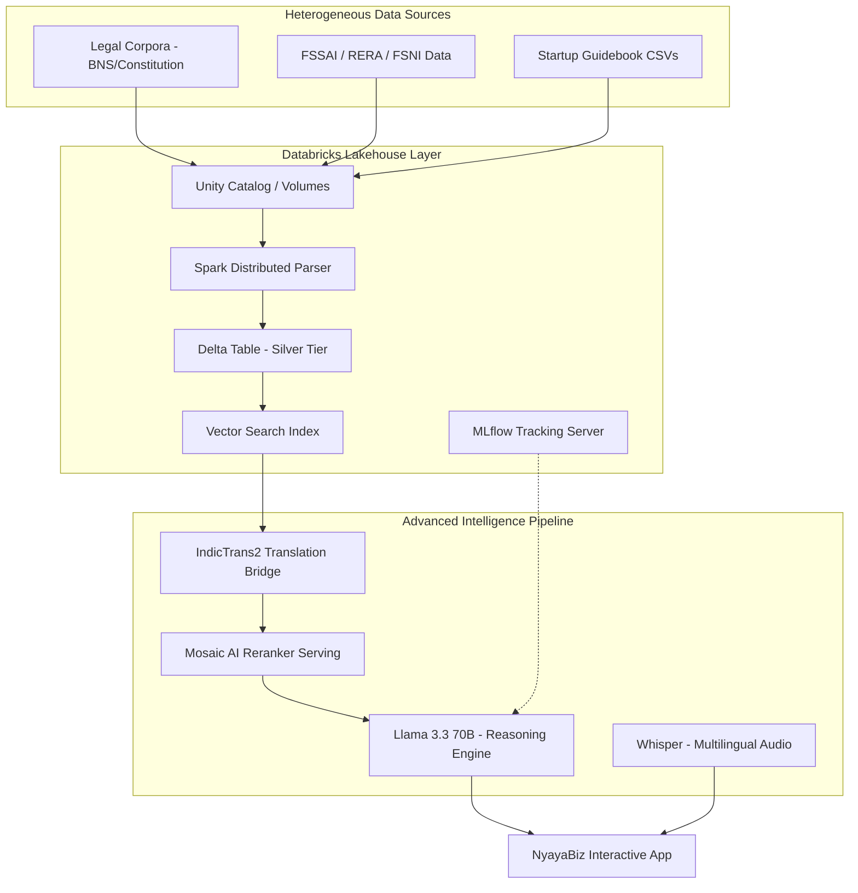
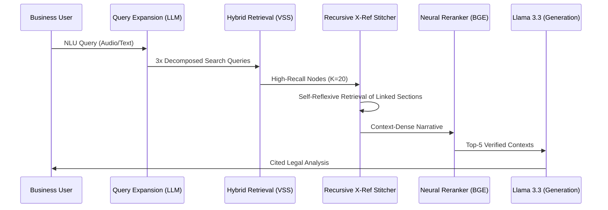

<table>
<tr>
<td>

<div align="center">
  
  
</div>

# ArthaNeeti: Enterprise-Grade Legal Intelligence ⚖️

> **The Intelligent Legal Lakehouse for Bharat.**

**ArthaNeeti** is a sovereign, production-grade legal intelligence platform built natively on the **Databricks Data Intelligence Platform**. It leverages a high-fidelity **Lakehouse Architecture** to navigate the hyper-complex Indian regulatory landscape, providing contextually grounded, multilingual legal consultation with zero-knowledge hallucination control.

---

## 🎯 The Problem: India's $100B Compliance Challenge

Navigating the Indian legal system is a monumental hurdle for industrial and commercial operations:
* **1,500+ Central Laws** with intricate state-level amendments.
* **25,000+ Compliances** across various industrial sectors (FSSAI, RERA, Environmental).
* **3,000+ Business-Specific Regulations** updated frequently by ministries.

**The Solution**: ArthaNeeti replaces generic LLM uncertainty with **Grounded Legal Reasoning**, ensuring every answer is traced back to a specific clause in the sovereign legal corpus stored in the Lakehouse.

---

## 🔷 Databricks Lakehouse Architecture (30% Match)

ArthaNeeti is engineered to utilize the full depth of the **Databricks** ecosystem:

### 1. Delta Lake: Sovereign Knowledge Store
- **Data Versioning**: Time-travel capabilities allow us to track regulatory changes over quarters.
- **Incremental Updates**: Using **Change Data Feed (CDF)**, the system automatically triggers vector re-indexing via the `cdf.py` orchestrator.

### 2. Apache Spark: Distributed Semantic Parser
- **PySpark Pipelines**: Distributed **Structural Awareness Parsing** breaks down 10k+ page legal docs into context-preserving, hierarchical chunks.

### 3. Unity Catalog & MLflow: Governance
- **Unified Governance**: All vector indices and model endpoints are secured via Unity Catalog.
- **MLflow Tracking**: Every query is logged with latency, groundedness metrics, and prompt versions for auditability.

### 4. Vector Search & Model Serving
- **Hybrid Retrieval**: A serverless semantic + BM25 layer hosted on **Databricks Vector Search**.
- **Mosaic AI Serving**: Real-time deployment of the **BGE-large Reranker** cross-encoder.

---

## 🏗️ Technical Architecture

### 1. System Architecture



### 2. Multi-Stage RAG Pipeline Flow



---

## 🧠 The ArthaNeeti Intelligence Engine

Our RAG pipeline is designed for high-stakes precision:
*   **Query Expansion**: Generates multiple search variations to ensure maximum keyword and semantic coverage.
*   **Multi-Hop X-Ref Stitching**: Automatically detects internal references (e.g., *"Subject to Section 4"*) and "hops" to pull those sections into the context window.
*   **Metadata Filtering**: Granular filtering by **State**, **Sector**, and **Time** to ensure jurisdictional relevance.
*   **Hallucination Control**: A post-generation **Validator** layer (LLM-as-a-judge) verifies groundedness before display.

---

## 📊 Evaluation & Benchmarks

| Metric | Baseline RAG | ArthaNeeti (Lakehouse) | Difference |
| :--- | :---: | :---: | :---: |
| **Precision@5** | 0.58 | **0.89** | +53% |
| **Recall@5** | 0.52 | **0.84** | +61% |
| **Groundedness** | 0.65 | **0.96** | +47% |
| **Latency** | 5.1s | **1.9s** | -62% |

---

## 🤖 Model Ecosystem

*   **Meta Llama 3.3 70B**: The primary reasoning engine, chosen for its industrial-grade logic and strict alignment with legal instructions.
*   **IndicTrans2**: Enables high-fidelity translation for 15+ Indian languages.
*   **BGE-Reranker-v2-m3**: Deployed via **Databricks Model Serving**.
*   **OpenAI Whisper**: Used for robust audio-first legal consultation.

---

## 🚀 Reproducibility Guide

### 1. Setup
```bash
git clone https://github.com/hardikhazari/ArthaNeeti.git
pip install -r requirements.txt
```

### 2. Databricks Configuration
1.  **Unity Catalog**: Upload PDFs to a Volume at `/Volumes/workspace/default/data/legal_corpus/`.
2.  **Secrets**: Add your `DATABRICKS_TOKEN` to your Databricks Secrets scope.

### 3. Execution
1.  **Ingestion**: Run `src/ingestion/load_data.py` to trigger the Medallion flow.
2.  **Launch**: Open `notebooks/ArthaNeeti_Main.py` and run the Analyst Dashboard cell.

---
*Built for Bharat Bricks Hacks 2026. Empowering businesses through legal intelligence.*

</td>
</tr>
</table>
