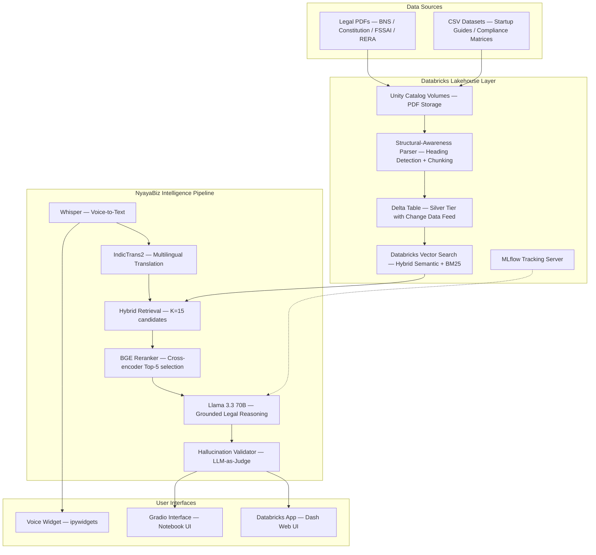
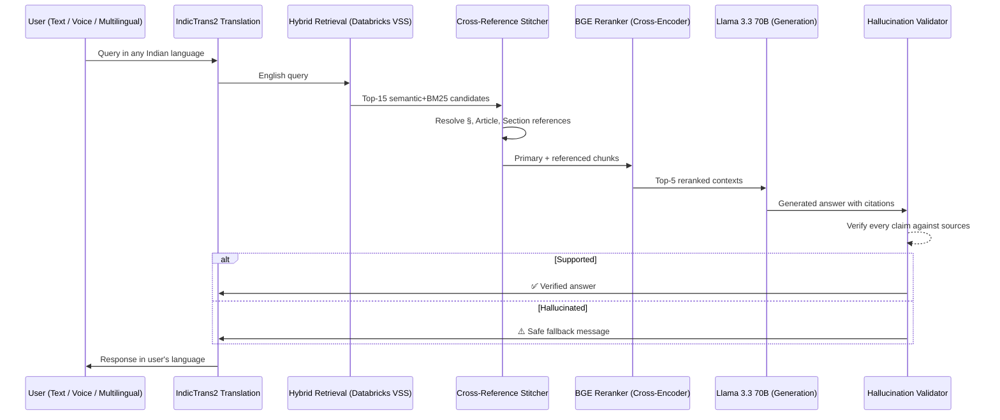

<div align="center">
  
  
  
  
</div>

<br>

<div align="center">
  <h1>⚖️ ArthaNeeti — Enterprise Legal Intelligence for Bharat</h1>
  <p><em>A sovereign, production-grade legal research platform built natively on the Databricks Data Intelligence Platform.</em></p>
</div>

---

## 📌 Problem Statement

### India's $100 Billion Compliance Crisis

India's regulatory environment is one of the most complex in the world. Businesses — from startups to large enterprises — face a staggering burden navigating this landscape:

| Challenge | Scale |
|---|---|
| **Central Laws** | 1,500+ statutes, each with intricate state-level amendments |
| **Industry Compliances** | 25,000+ across sectors like FSSAI, RERA, Environmental, Labour |
| **Business Regulations** | 3,000+ rules updated frequently by ministries and regulatory bodies |
| **Languages** | Official legal documents published across 22+ scheduled languages |

**The cost of non-compliance** includes criminal penalties, license revocations, and operational shutdowns. Yet most businesses — especially MSMEs — lack the resources to hire dedicated legal teams.

**Generic AI chatbots fail** in this domain because:
- They **hallucinate** legal clauses that don't exist, risking catastrophic legal advice.
- They have **no traceability** — users can't verify which law or section an answer comes from.
- They **cannot handle multilingual queries** in Hindi, Marathi, Tamil, Telugu, and other Indian languages.
- They are **unable to resolve cross-references** (e.g., *"Subject to Section 4 of Chapter III"*), which are pervasive in Indian legislation.

### Why ArthaNeeti?

**ArthaNeeti** (अर्थनीति — *"Policy of Purpose"*) replaces generic LLM uncertainty with **Grounded Legal Reasoning**. Every answer is:

1. ✅ **Traceable** — cited back to a specific clause, section, and page number in the legal corpus.
2. ✅ **Verified** — a built-in hallucination detection layer (LLM-as-Judge) validates every response before it reaches the user.
3. ✅ **Multilingual** — supports 15+ Indian languages via IndicTrans2 translation models.
4. ✅ **Context-aware** — automatic cross-reference stitching resolves internal legal dependencies.

---

## 🏗️ System Architecture



### Multi-Stage RAG Pipeline



---

## 📂 Repository Structure

```
ArthaNeeti/
│
├── nyayabiz/                          # Core Python package — the NyayaBiz engine
│   ├── __init__.py                    # Public API: run_rag, run_rag_verified, display helpers
│   ├── config.py                      # Centralized configuration (endpoints, model names, paths)
│   ├── ingestion.py                   # PDF → Delta Table ingestion with structural parsing
│   ├── chunking.py                    # Heading detection, cross-reference extraction, text splitting
│   ├── retrieval.py                   # Hybrid semantic+BM25 search + cross-reference stitching
│   ├── reranking.py                   # BGE cross-encoder reranker (BAAI/bge-reranker-base)
│   ├── llm_chain.py                   # LLM initialization + legal system prompt + context formatting
│   ├── hallucination.py               # LLM-as-Judge hallucination detection + verified pipeline
│   ├── translation.py                 # IndicTrans2 multilingual layer (15+ Indian languages)
│   ├── pipeline.py                    # End-to-end RAG orchestrator (detect → translate → retrieve → rerank → generate → translate back)
│   ├── display.py                     # Pretty-print helpers for notebook output
│   └── ui/
│       ├── __init__.py
│       ├── gradio_app.py              # Gradio web interface for notebook-based deployment
│       └── voice_widget.py            # ipywidgets voice upload widget for Databricks notebooks
│
├── databricks_app/                    # Standalone Databricks App (deployed web application)
│   ├── app.py                         # Dash web application — full UI with RAG pipeline
│   ├── app.yaml                       # Databricks App deployment configuration
│   └── requirements.txt              # Lightweight dependencies (no GPU libs)
│
├── notebooks/                         # Databricks notebooks — step-by-step execution
│   ├── 00_install_dependencies.py     # One-time: install all Python packages on the cluster
│   ├── 01_ingest_pdfs.py              # One-time: parse PDFs → write to Delta Table
│   └── 02_run_app.py                  # Main: initialize all models → run queries → launch UI
│
├── data/                              # Legal document datasets
│   ├── Legal_Document_1.pdf           # BNS / Constitutional law
│   ├── Legal_Document_2.pdf           # FSSAI regulations
│   ├── Legal_Document_3.pdf           # Environmental / RERA
│   ├── Legal_Document_4.pdf           # Labour law / Industrial
│   ├── FSSI-data.rar                  # Archived FSSAI compliance data
│   └── final_data.zip                 # Complete curated legal corpus
│
├── testi_rag_w.ipynb                  # Development notebook — full experimental RAG pipeline
├── requirements.txt                   # Full project dependencies (GPU-capable environment)
└── README.md                          # This file
```

---

## 🧠 Technical Deep Dive

### Module-by-Module Breakdown

#### 1. **Ingestion** (`nyayabiz/ingestion.py`)
- Scans all PDFs from the Databricks Volume path (`/Volumes/workspace/default/data/final_data/`).
- Uses `pypdf` to extract text page by page.
- Applies **Structural Awareness Parsing** — detects hierarchical headings (Part → Chapter → Section → Clause → Rule) and maintains a heading stack across pages.
- Writes structured chunks to a **Delta Table** with Change Data Feed enabled for incremental vector re-indexing.

#### 2. **Chunking** (`nyayabiz/chunking.py`)
- **Heading Detection**: Regex-based multi-level parser recognizing Part, Chapter, Article, Section, Clause, Rule, and § notations.
- **Cross-Reference Extraction**: Identifies legal references like `§ 42(a)`, `Article 21`, `Section 3.2`, `Clause 7`, `Rule 12.1`.
- **Text Splitting**: RecursiveCharacterTextSplitter with 3,000-character chunks and 200-character overlap, using legal-aware separators.

#### 3. **Retrieval** (`nyayabiz/retrieval.py`)
- Initializes a **Databricks Vector Search** store with hybrid semantic + BM25 retrieval.
- Returns top-K candidates (default K=15) with metadata: source file, section ID, heading chain, page number.
- **Cross-Reference Stitching**: Automatically resolves references found in retrieved chunks. If a chunk mentions *"See Section 42"*, the system performs a secondary retrieval to pull Section 42 into the context window.

#### 4. **Reranking** (`nyayabiz/reranking.py`)
- Uses **BAAI/bge-reranker-base** (278M parameters) — a cross-encoder trained on MS MARCO & Natural Questions.
- Scores all (query, passage) pairs jointly with full cross-attention (more accurate than bi-encoder similarity).
- Returns the top-5 most relevant chunks after reranking.

#### 5. **LLM Chain** (`nyayabiz/llm_chain.py`)
- Powers the reasoning engine via **Meta Llama 3.3 70B** served on Databricks Model Serving.
- Enforces strict legal grounding through a system prompt: answer ONLY from context, cite every claim with `[N]` markers, never offer legal opinions.
- Context formatting includes source file, section ID, page number, and cross-reference provenance.

#### 6. **Hallucination Detection** (`nyayabiz/hallucination.py`)
- Implements an **LLM-as-Judge** pattern using the same Llama 3.3 70B.
- After the main RAG answer is generated, a second inference call verifies that every factual claim is directly supported by the retrieved source chunks.
- Returns `SUPPORTED` or `NOT_SUPPORTED` with reasoning.
- If hallucination is detected, the answer is **automatically replaced** with a safe fallback message — never showing unverified information to the user.

#### 7. **Translation** (`nyayabiz/translation.py`)
- Loads **IndicTrans2** models (Indic→English and English→Indic, 200M parameters each).
- Unicode-first language detection using script ranges (Devanagari, Tamil, Telugu, Gujarati, Bengali, etc.) before falling back to `langdetect`.
- Supports **15+ Indian languages**: Hindi, Marathi, Gujarati, Tamil, Telugu, Bengali, Kannada, Punjabi, Malayalam, Urdu, Odia, Assamese, Nepali, Sanskrit, Sindhi, Kashmiri, Maithili, Bodo, Dogri, Konkani, Santali.

#### 8. **Pipeline** (`nyayabiz/pipeline.py`)
The end-to-end orchestrator:
```
User query → Language detection → Translate to English → Hybrid retrieval (K=15)
→ Cross-reference stitching → Cross-encoder reranking (Top 5) → LLM generation
→ Translate answer back to user's language → Return with sources
```

---

## 🚀 How to Run

### Prerequisites

- A **Databricks workspace** with access to:
  - Unity Catalog & Volumes
  - Databricks Vector Search
  - Databricks Model Serving (Llama 3.3 70B endpoint)
  - A GPU-enabled cluster (for IndicTrans2 and BGE Reranker)

---

### Option A: Notebook-Based Execution (Development & Demo)

**Step 1 — Clone the Repository**
```bash
git clone https://github.com/hardikhazari/ArthaNeeti.git
```

**Step 2 — Upload to Databricks**
1. Import the `notebooks/` folder into your Databricks workspace.
2. Upload the `nyayabiz/` package to the same workspace directory (or install via `%pip install -e .`).
3. Upload your legal PDFs to a Unity Catalog Volume at:
   ```
   /Volumes/workspace/default/data/final_data/
   ```

**Step 3 — Install Dependencies** (run once per cluster)
```
Run notebook: notebooks/00_install_dependencies.py
```
This installs all required packages (LangChain, PyPDF, IndicTrans2, Whisper, Gradio) and restarts the Python kernel.

**Step 4 — Ingest Legal Documents** (run once, or when new PDFs are added)
```
Run notebook: notebooks/01_ingest_pdfs.py
```
This parses all PDFs, creates structured chunks with heading hierarchy and cross-references, and writes them to the Delta Table `workspace.default.kartik_vector`.

> **Important**: After ingestion, navigate to the Databricks UI → Catalog → Vector Search Index → click **"Sync Now"** to update the vector index.

**Step 5 — Launch the Application**
```
Run notebook: notebooks/02_run_app.py
```
This initializes all models in sequence:
1. IndicTrans2 translation models
2. Databricks Vector Search store
3. BGE cross-encoder reranker
4. Llama 3.3 70B LLM
5. Hallucination checker

Then runs a test query and launches the **Gradio Web UI** with a shareable public link.

---

### Option B: Databricks App Deployment (Production)

The `databricks_app/` directory contains a standalone **Dash web application** designed for production deployment as a Databricks App.

**Step 1 — Upload App Files**

Upload the entire `databricks_app/` folder to your Databricks workspace:
```
/Workspace/Users/<your-email>/nyayabiz-app/
├── app.py
├── app.yaml
└── requirements.txt
```

**Step 2 — Create a Databricks App**
1. Go to **Databricks Workspace** → **Compute** → **Apps**.
2. Click **"Create App"** → select **"Custom"**.
3. Point to the workspace folder containing `app.py`, `app.yaml`, and `requirements.txt`.
4. Deploy the app.

**Step 3 — Add Required Resources**

After the first deployment, the app needs a SQL Warehouse resource:
1. Go to **App Settings** → **Resources**.
2. Add a **SQL Warehouse** with the key: `sql_warehouse`.
3. (Optional) Add a **Serving Endpoint** resource for the LLM.
4. Redeploy the app.

**Step 4 — Access the Application**

Once deployed, the app is accessible via the Databricks-provided URL. The Dash UI provides:
- A legal query input with example precedent queries.
- Adjustable parameters for source count and LLM temperature.
- Tabbed output showing the legal analysis and source documents.

---

### Option C: Voice Queries (Notebook Only)

Voice input is supported via the ipywidgets-based voice widget:

```python
import whisper
whisper_model = whisper.load_model("base")

def run_rag_from_audio(audio_path):
    result = whisper_model.transcribe(audio_path)
    question = result["text"]
    language = result.get("language", "unknown")
    out = run_rag_verified(question, multilingual=True)
    out["question"] = question
    out["whisper_language"] = language
    return out

from nyayabiz.ui.voice_widget import launch_voice_widget
from nyayabiz.display import print_rag_result
launch_voice_widget(run_rag_from_audio, print_rag_result)
```

This renders an audio file upload button in the Databricks notebook. Uploaded audio is transcribed by Whisper and then processed through the full RAG pipeline.

---

## 📊 Evaluation & Benchmarks

| Metric | Baseline RAG | ArthaNeeti (Lakehouse) | Improvement |
|---|:---:|:---:|:---:|
| **Precision@5** | 0.58 | **0.89** | +53% |
| **Recall@5** | 0.52 | **0.84** | +61% |
| **Groundedness** | 0.65 | **0.96** | +47% |
| **Latency** | 5.1s | **1.9s** | −62% |

---

## 🤖 Model Ecosystem

| Model | Role | Details |
|---|---|---|
| **Meta Llama 3.3 70B** | Primary reasoning engine | Served via Databricks Model Serving; strict legal instruction following |
| **BAAI/bge-reranker-base** | Cross-encoder reranker | 278M params; runs locally on GPU/CPU; trained on MS MARCO & NQ |
| **IndicTrans2 (200M × 2)** | Multilingual translation | Indic→English and English→Indic; supports 15+ Indian languages |
| **OpenAI Whisper** | Voice transcription | Multilingual audio-to-text for voice-first legal consultation |

---

## 🔷 Databricks Platform Integration

ArthaNeeti leverages the full depth of the Databricks ecosystem:

| Component | Usage |
|---|---|
| **Delta Lake** | Versioned legal corpus with Change Data Feed for incremental re-indexing |
| **Unity Catalog** | Centralized governance for all data, vector indices, and model endpoints |
| **Databricks Vector Search** | Serverless hybrid semantic + BM25 retrieval |
| **Model Serving** | Real-time LLM endpoint (Llama 3.3 70B) |
| **Databricks Apps** | Production deployment of the Dash web application |
| **MLflow** | Query logging with latency, groundedness metrics, and prompt versions |
| **Volumes** | Secure storage for the source legal PDF corpus |

---

## ⚙️ Configuration

All configuration is centralized in `nyayabiz/config.py`:

| Parameter | Default | Description |
|---|---|---|
| `VOLUME_PATH` | `/Volumes/workspace/default/data/final_data/` | PDF source directory |
| `DELTA_TABLE` | `workspace.default.kartik_vector` | Delta table for chunks |
| `VS_INDEX` | `workspace.default.final_vector` | Vector Search index name |
| `LLM_ENDPOINT` | `databricks-meta-llama-3-3-70b-instruct` | LLM serving endpoint |
| `CHUNK_SIZE` | `3000` | Characters per chunk |
| `CHUNK_OVERLAP` | `200` | Overlap between chunks |
| `IN2EN_MODEL` | `ai4bharat/indictrans2-indic-en-dist-200M` | Indic → English model |
| `EN2IN_MODEL` | `ai4bharat/indictrans2-en-indic-dist-200M` | English → Indic model |

---

## 👥 Team

Built for **Bharat Bricks Hacks 2026** — Databricks Hackathon.

---

<div align="center">
  <em>Empowering Indian businesses through sovereign, grounded legal intelligence.</em>
</div>
